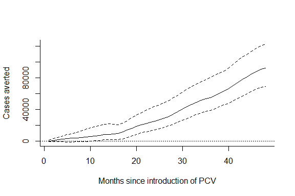

Estimated change in pneumonia mortality associated with the introduction of PCV10 In Brazil
================
PAHO/Yale analysis team
September 13, 2018

-   [Comparison of observed and expected number of cases](#comparison-of-observed-and-expected-number-of-cases)
-   [Cumulative cases averted among children &lt;12months](#cumulative-cases-averted-among-children-12months)
-   [Esimated decline by age group](#esimated-decline-by-age-group)

Comparison of observed and expected number of cases
---------------------------------------------------

Cumulative cases averted among children &lt;12months
----------------------------------------------------

Esimated decline by age group
-----------------------------

|     | Stacking Estimate (95% CI) |
|-----|:---------------------------|
| 0   | 0.83 (0.75, 1.01)          |
| 1   | 0.77 (0.7, 0.81)           |
| 2   | 0.77 (0.72, 0.82)          |
| 3   | 0.82 (0.74, 0.91)          |
| 4   | 0.8 (0.7, 0.91)            |
| 5   | 0.82 (0.72, 0.94)          |
| 6   | 0.91 (0.77, 1.17)          |
| 7   | 1.02 (0.89, 1.18)          |
| 8   | 0.99 (0.92, 1.07)          |
| 9   | 0.75 (0.71, 0.8)           |
